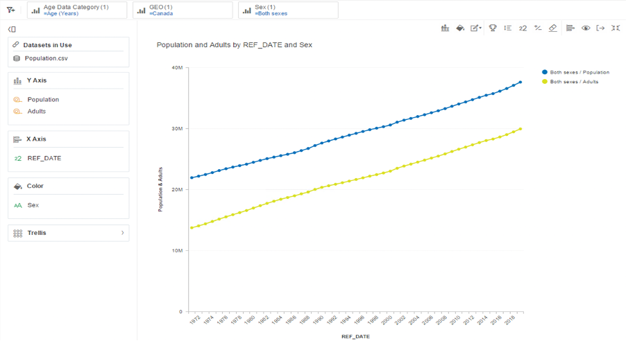
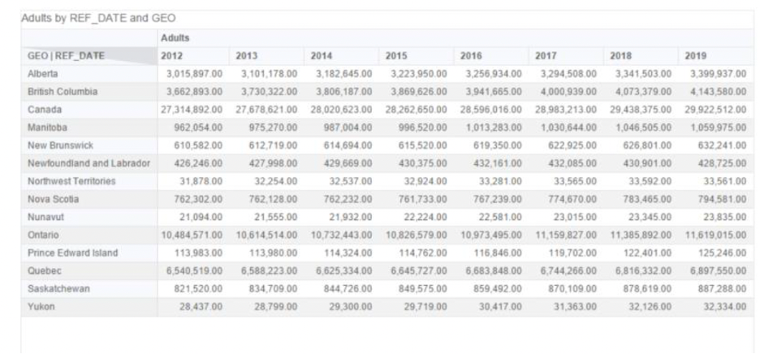
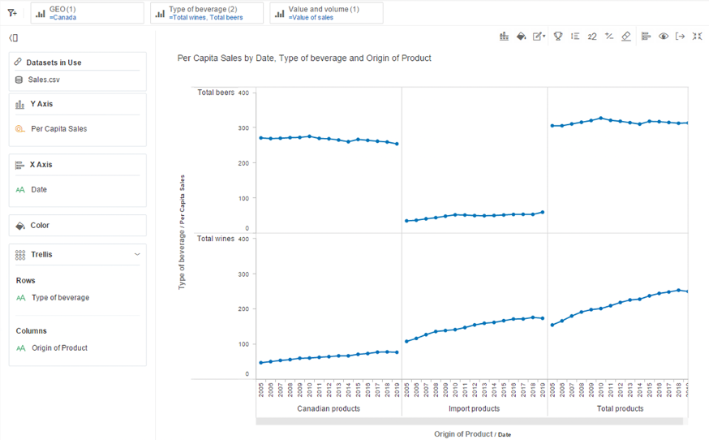
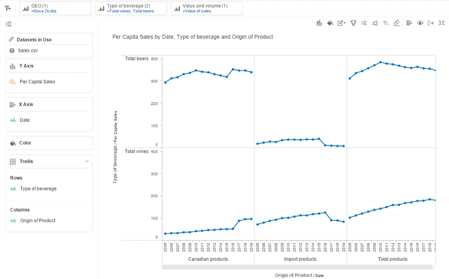
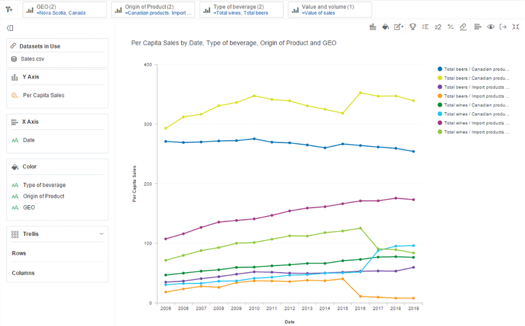
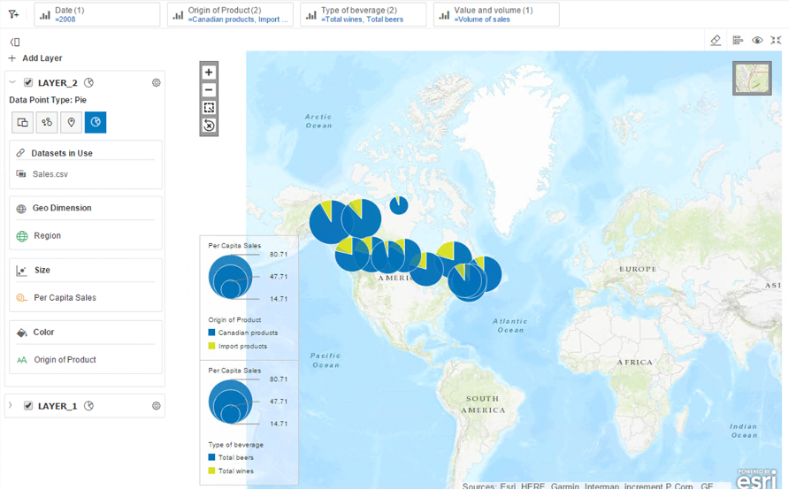
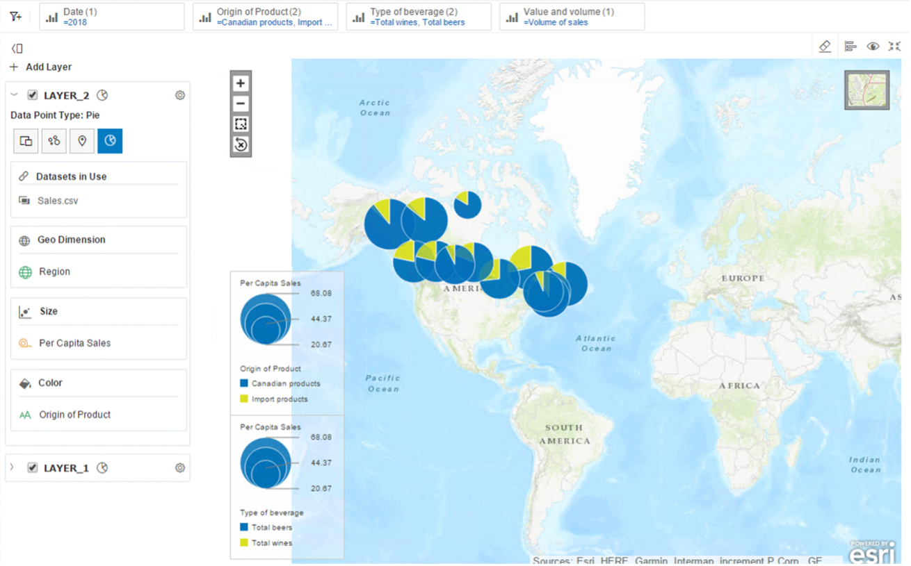

# SAP Lumira Discovery
SAP Lumira is used to analyze alcohol purchasing preference in Canada, and how does it differ by province over the last few years.

## About SAP Lumira Discovery

It is a self-service tool used for data visualisation of businesses. It helps in creating impactful interactive maps, charts, dashboards, and Business Intelligence applications from all types of data, to accelerate and ease the decisions. It is preferred over other visualization tools as it provides full integration with SAP products and Business Objects. It gives the users an ability to create custom maps which are visually appealing and informative. Following are the key capabilities of this tool (SAP, 2021):

 - Explore and analyze the data via a simplified solution in the form of storytelling or data visualization
 - Develop interactive dashboards and analytical applications in such a way that it is collaborative and provides access to actionable insights improves the interactivity with the user.
 - It provides a secure and trusted access so that it is feasible to connect to data anytime for deeper insights such as applying filters to data, drill-down capabilities, hierarchical navigation, and many more.
 - Provides optimized and real-time access to governed data and enable full connectivity to functionality of each data source.

## Dataset and Research questions

SAP Lumira will be used to analyze alcohol purchasing preference in Canada, and how does it differ by province over the last few years. We will be using 2 datasets to derive this information, first being related to population as it varies in different provinces. Also, we will only be considering the population about 19 years old to get per capita comparisons. Therefore, after transforming the data we will be deriving the results via the visualisations created through this tool. We are using Population and Sales data, both obtained from Statistics Canada (2021). The files obtained are in CSV format and the reference period is taken from 2012 to 2019. The dataset can be edited or transformed in the Data view, and it can be visualised in the Design view.

Following are the questions that will be answered:

 - Number of adults who are legally allowed to purchase alcoholic beverages
 - How do alcohol purchasing preferences vary in Canada over the last several years?
 - How do alcohol purchasing preferences vary in Nova Scotia, over the last several years?
 - How does alcohol preference differ between Nova Scotia and Canada over the last several years?
 - What are the per Capita Sales of Canadian Products and Imported products in 2018 and how does it differ from 2008?

## Applying the Analytical Tool and Results

##### Question 1: Number of adults who are legally allowed to purchase alcoholic beverages
The calculated dimension is created called as adults to include all individuals who are above 19 years old. A Line Chart is created which suggests that total number of adults in Canada in 2018 is approximately 30 million whereas the total population is close to 40 million approximately.

 

##### Question 2: How do alcohol purchasing preferences vary in Canada, over the last several years?
To answer this question, a table is created which includes number of adults in each province in the respective years which is exported and then merged to Sales.csv file. The following line graph suggests that Canadian beer is preferred more than imported beer, while imported wine is preferred more than Canadian wine. The total beer preference has somewhat remained constant over the years, while the wine popularity in Canada has gradually increased throughout the years.

 
 

##### Question 3: How do alcohol purchasing preferences vary in Nova Scotia, over the last several years?
The following line graph suggests that the preference towards Canadian wine over imported wine increased after 2016, while overall the popularity of wine has gradually increased. In case of beer, the same trend has been observed that the popularity of Canadian beer has increased over imported beer after 2016. Overall, the preference for beer has been decreasing gradually after 2009.

 

##### Question 4: How does alcohol preference differ between Nova Scotia and Canada over the last several years?
The following graph suggests that while the popularity of Canadian beer has increased in Nova Scotia, it has gradually decreased in rest of Canada. The preference towards imported beers has somewhat remained constant in Canada, while it has decreased a lot in Nova Scotia after 2016. Overall, Per Capita Sales of Canadian beer is more than the imported beer. The Canadian wine is bought more by people over the years in Canada, while in Nova Scotia its preference has tremendously increased after 2016. In case of imported wines, its popularity has also been increasing continuously over the years both in Canada and Nova Scotia, but the trend is seen downward after 2017 in Nova Scotia.

Overall, the Canadian beer is opted the most by Nova Scotians as compared to the rest of Canada, followed by imported wine. Interestingly after 2017, the Canadian wine gained popularity in Nova Scotia and surpassed the Per Capita Sales of the rest of Canada.

 

##### Question 5: What are the per Capita Sales of Canadian Products and Imported products in 2018 and how does it differ from 2008?
Interestingly, the graphs depicts that the overall per capita sales have decreased in 2018 as compared to 2008. Canadian tastes have shifted over time, but beer remains the first choice for most of the people. Imported beers are preferred much less than Canadian beers in both the years. This may be contributed to the preference towards local taste. Although, the trend is opposite in case of wine as overall, imported wine has more popularity than Canadian wine.

 
 

## Analysis and Critique of the Tool

As a first-time user of SAP Lumira, I found it easy and user-friendly to visualise and analyse the data. It could be used to create interactive and meaningful charts to derive actionable insights. From uploading the Excel/ CSV file and transforming the data to examining the data via various kinds of visualisations, the process was very simple. Although, this tool is not mac-friendly, but it can be easily used in Windows.

The key strength of this tool is that it can be used for large datasets and can be adopted by anyone without the requirement of prior coding knowledge. Various kinds of complicated charts can be created without much hassle The results, or the analysis can be showed to everyone in the form of storytelling through the interactive charts while also having the real-time access to the datasets. It provides the functionality of filtering the data, merging different datasets, hierarchical navigation, using multiple datasets at once, drill-down capabilities and other features of transforming the data (SAP, 2021).

While these features are good to have, but there are already many tools in the market which provide the similar functionalities and can be used easily on all kinds of interfaces. This tool creates an In-Memory Database when loading data that uses the PC’s RAM which may cause to losing the work if not saved properly in case the PC does not have enough RAM. It does not provide the suggestions or any kind of error warnings, therefore it is hard to know whether the work being done is error free or not.

## Conclusion:
This tool is in the market since a long time and has been used by many businesses to gain deeper insights about their data, but there are already tons of visualisations tools which provide a better interface and are more user-friendly. This tool is still used by many people and is very helpful for the beginners who like to visualise and gain insights from the data, but do not have much technical or coding background. Therefore, I would recommend this tool to such people, who have windows and a laptop with better RAM.
